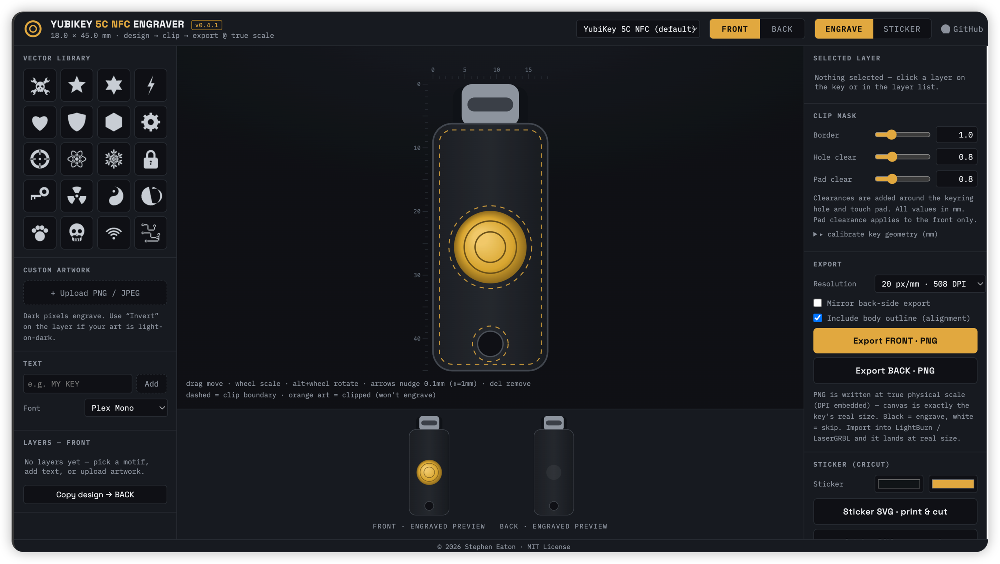
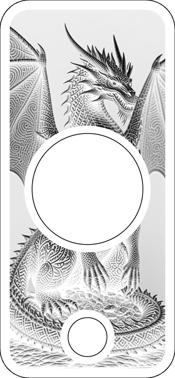
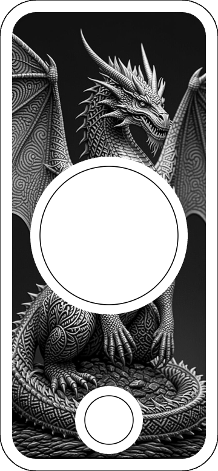
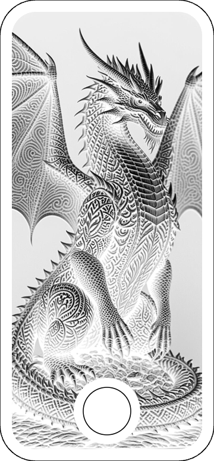
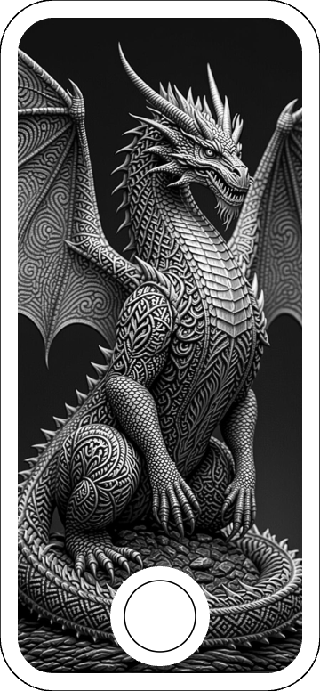

# YubiKey 5C NFC · Engraving Designer

**🌐 Live demo: <https://madeinoz67.github.io/yubikey-engraver/>**

A single-file, local-first web app for designing laser-engraving artwork for
**every YubiKey / security-key form factor — all models except the Nano**
(the flush USB-stick Nano has no exposed surface to engrave). Open the HTML
file in any modern browser — **no server, no install, no build step.**

Author: **Stephen Eaton** · License: **MIT**

## Features

- Dimensionally-accurate YubiKey outline; design **front and back** artwork
- Built-in **vector motif** library + **JPEG/PNG upload** + **text layers**
- Move (drag / arrow keys), scale (wheel / slider), rotate (Alt+wheel / slider)
- **Front mask clips:** adjustable border, keyring hole, touch pad
- **Back mask clips:** adjustable border, keyring hole
- Live **engraved preview** (light-on-black) for both sides
- **Export** clipped artwork as PNG at true physical scale (`pHYs` DPI embedded),
  ready for LightBurn / laser-engraving software (**black = engrave**)
- **COLOR view + sticker export** — per-layer colours and full-colour image
  printing for Cricut print-and-cut (toggle COLOR/ENGRAVE; laser export stays
  monochrome black-on-white)

## Supported models

Built-in presets for the common engraveable YubiKeys:

- YubiKey 5C NFC · YubiKey 5C (compact)
- YubiKey 5 NFC (USB-A)
- YubiKey Bio C (fingerprint)
- Security Key C NFC

Any other engraveable key can be dialled in with the **calibrate** panel
(measure W / H / hole / pad in mm with calipers). **Nano form-factor keys are
not supported** — the flush USB-stick body leaves no surface to engrave.

## Use

1. Open `yubikey-engraver.html` in Chrome / Firefox / Safari — or use the
   [hosted version](https://madeinoz67.github.io/yubikey-engraver/).
2. Pick your model (or calibrate a custom one), then design — drop in a motif
   or image, add text, position with drag / arrows / wheel.
3. **Export PNG** → import into LightBurn (or your laser software) → engrave
   (black = engrave).

## Example output

Real exports at 20 px/mm (true physical scale, `pHYs` DPI embedded) — the
engrave-ready mask, tightly cropped to the key body.

|   | **Normal** (black = engrave) | **Inverted** |
|---|---|---|
| **Front** |  |  |
| **Back** |  |  |

Use the **Invert** option on a layer (or invert in your laser software) when
your artwork is light-on-dark — pick whichever polarity matches your material.

## Local development

It's a single static HTML file. Edit, refresh the browser, done. No
dependencies, no build chain.

## Agent instructions

If you're an AI agent editing this repo, read this section first, then
[`docs/STYLEGUIDE.md`](docs/STYLEGUIDE.md) for the full conventions and the
worked examples (add a model / motif / control).

**The app is one file** — `yubikey-engraver.html`. Vanilla HTML / CSS / JS. No
build step, no bundler, no framework, no `npm`. It runs from `file://` or any
static host.

- **Do not** split it into multiple files.
- **Do not** add dependencies — Google Fonts is the only external resource.
- **Do not** introduce a build tool, transpiler, or TypeScript.

**Never break laser output.** These are load-bearing invariants:

- All key dimensions are in **millimetres**. Export multiplies `mm × px/mm` to
  render the canvas at true physical size.
- Export polarity is **black = engrave, white = skip**. Don't invert it.
- Exported PNG embeds physical DPI (`pHYs`) so it lands at real size in
  LightBurn / LaserGRBL.
- The clip mask is **even-odd**: body-inset **minus** the keyring hole, and on
  the front also **minus** the touch pad.

**Verify before claiming done.** Open `yubikey-engraver.html` in a real browser
(Chrome / Safari) after every change — check the console, the editor canvas, the
engraved previews, and run an export. UI / render verification uses a real
browser screenshot, not `curl`. The live deploy at the URL above mirrors `main`.

**Match the existing style.** Design tokens in `:root`; camelCase IDs; the `$()`
DOM accessor (`const $ = s => document.querySelector(s)`); single quotes;
`const` by default; Path2D geometry in a −1…1 unit box filled with `'evenodd'`.
`MODELS` is the **immutable** catalogue; `KEY` is the **live, calibratable**
copy — don't confuse them.

**Commits** go straight to `main` (single-author). Pushing to `main`
auto-deploys to GitHub Pages.

## Deploy (GitHub Pages)

Pushing to `main` triggers [`.github/workflows/deploy.yml`](.github/workflows/deploy.yml),
which publishes the app to GitHub Pages. The workflow stages
`yubikey-engraver.html` as `index.html` so the site root serves the app
directly at <https://madeinoz67.github.io/yubikey-engraver/>.

## License

MIT — see [LICENSE](LICENSE).
© 2026 Stephen Eaton
